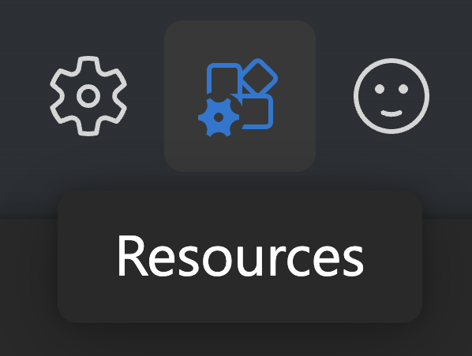

# Azure OpenAI Environment Variables
## OpenAI
```bash
AZURE_OPENAI_API_VERSION="2024-02-01"
AZURE_OPENAI_API_KEY="123jfasb38f857d8i43eaf1214f"
AZURE_OPENAI_ENDPOINT="https://mygreatendpoint.openai.azure.com/"
```
**Note: Make sure you have turned on the switch at the top to 'Use the new version' and you are using the new version of Azure OpenAI Studio.**

In [Azure OpenAI Studio](https://oai.azure.com), on the bar at the top, click on 'Resources'.



You will see a screen with the values of 'Endpoint' and 'Key'.

For `AZURE_OPENAI_API_VERSION` you can leave it as `2024-02-01`.

### Deployments
Listing the available deployments - and the respective models (LLMs) that are used - is not straightforward and requires more advanced tokens/permissions than the API_KEY listed above.

We are actively working on a way to include this as part of our API.